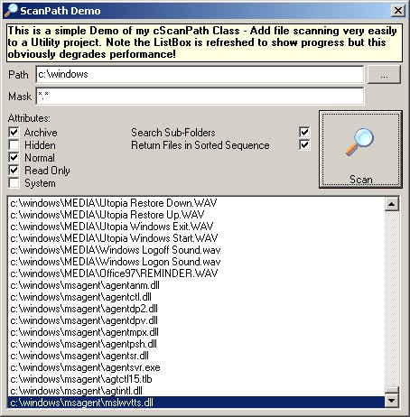

**PSC-ScanPath (2005)** by Richard Mewett  
A submission for Planet Source Code  

Fast API based file finder. Class scans a path (with Attributes, Mask, Date, Size filter properties) and returns the files & folders by raising events. Optionally scan nested sub-folders and sort results. Created to make File Utility creation very rapid. Hope it may be useful as example of API file handling and WithEvents. I welcome feedback!

⭐ Features  
* Scan sub-directories
* Apply Filters
* Sort Results

